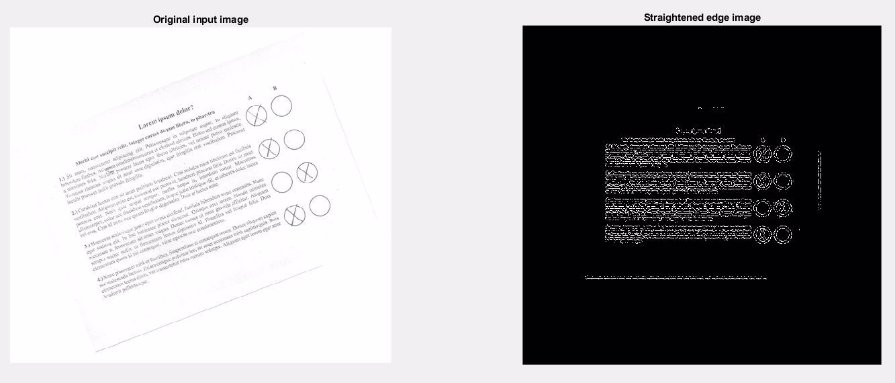
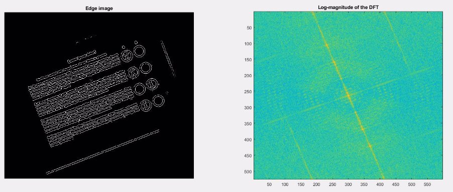

Assignment 2

Basic Image Processing Fall 2021

General rules

This is the second Assignment. There will be two more Assignments during the semester.

Point value:   **20 points**, which is 20% of the total assignment points. Deadline:   **October 25, 2021 23:59:59** (late submission until Oct. 27)

This is a not-guided exercise. The description of this assignment is general and does not focus on the details as in case of the Lab exercises.

The main task is to provide a good, reasonable solution. You may code “freely” (only minimal restrictions on file names and outputs are given).

Problem formulation

You have to write a custom data processing (optical pattern / data recognition) program that can straighten a rotated page of text, can identify optical markers in the page and can digitize the handwritten data

**Input:**  an image showing a possibly rotated page of a questionnaire **Output:**  the digitized data

3

Tasks to do

Write a script that…

1. loops through the input folder and processes each image as follows:
1. applies histogram operations (e.g. stretching) to enhance quality
1. applies Fourier transform to get the phase and magnitude matrices
1. uses the frequency domain data to restore the rotation of the image
1. applies a Hough-like transformation to find the circles in the image
1. examines the histogram inside the circles
1. decides for each circle whether it contains a cross (an X) or not
1. stores the digitized value in an accumulator (an array)
1. after each image is processed, returns the statistics of the votes.

4
Key results to be presented:

You may code freely, as there are not so many restrictions on what to use. However, please create the followings:

1) A function named processor which takes and argument (image matrix) and returns the digitized data (a 4×2 matrix containing ones at places where the corresponding circles contained an X)
1) A script that iterates through all images in the input folder, applies the processor function to each of them and summarizes the results.

5
Key results to be presented:

Further details of the processor function:

It should have an optional second argument (verbose) which is False by default. If set to True, the function should raise 3 figures as follows:

Figure 1 shows the input image and the rotated, binarized, “edge” one Figure 2 shows the found circles and the corresponding Hough space Figure 3 shows the cropped image of every circle with a title saying

whether this circle contains a cross or not

6
Figure 1

7
Figure 2

8
Figure 3

9

Console output after the processing is complete

10

There is no code package for this assignment.

All scripts and functions must be written entirely by you.

Download the image to be processed from here: <https://beta.dev.itk.ppke.hu/bipa/assignment_02>

11

Submission & hints

You should create a script named a02\_NEPTUN.m where the NEPTUN part is your Neptun ID. This has to be the main script; running that must be able to solve the problem. Please also create the processor.m function.

You are allowed to create other files (e.g. additional functions) too, if necessary.

Please submit ALL files (including the input folder as well) in a **ZIP** file via the Moodle system.

**Check the upcoming slides for hints!**

12
Hint 1

Start by applying an RGB to grayscale operation and then an edge finding operation. You may consider using the built-in edge function with an appropriate method and additional parameters.

To straighten the image you may use the magnitude of the DFT of this edge-image which has maxima values along a line crossing the center.

The angle of this line is the same as the rotation of the image. See the figure in the next slide!

13
Hint 1

14
Hint 3

The Hough method can be modified in order to find circles instead of lines. Use the equation of the circle:

Also, it might be beneficial to read the following article: <https://en.wikipedia.org/wiki/Circle_Hough_Transform>

In this Assignment, the radius of the circle can be considered known, so the Hough space can (and should) be 2D.

15
Hint 4

Identify the relationship between the circles by the position of their centers. Use this info to identify which circle corresponds to which answer option.

To detect the cross in the circle you may use the histogram of the cropped circle and / or anything else that comes to your mind.

E.g. a Laws-like filter (or a simple convolution) can be used to detect whether the content looks like an X or not. Any other methods (e.g. Fourier based) can be good too.

16

Grading

The final score of this assignment is the sum of the following points:

The script filename is correct, it’s a script, function exists, name is correct 2 points Script processes all images in the input folder 1 point

Edge finding exists, chosen method and its parameters are OK 1 point

FFT of the edge image exists, maxima values are used for rotation angle 2 points Image is straightened using the angle in the previous point, Fig.1 exists 1 point Hough space exists, has correct dimensions and type 2 points Hough algorithm is for circles, it works as expected, Fig.2 exists and looks good 2 points Found circles are cropped as requested, exactly 8 circles are found 2 points Cross detection works as expected, Fig.3 exists and looks good 2 points Function returns a 4×2 boolean matrix, values are OK, accumulation is OK 2 points

The script shows a summary after the processing is done 1 point

Code quality (readability, understandability, good comments and structure) 2 points **TOTAL:**      **20 points** 17

Contact

If you have any further questions regarding this assignment, contact

**Márton Bese NASZLADY** 

via **Teams** (in private chat) or write an email to naszlady@itk.ppke.hu

18

**THE END**
19
